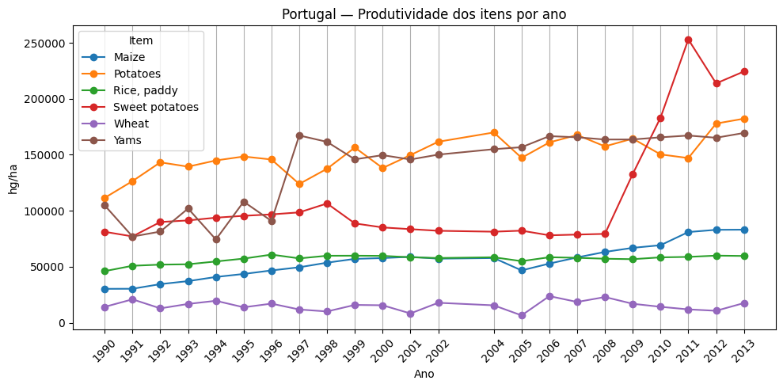
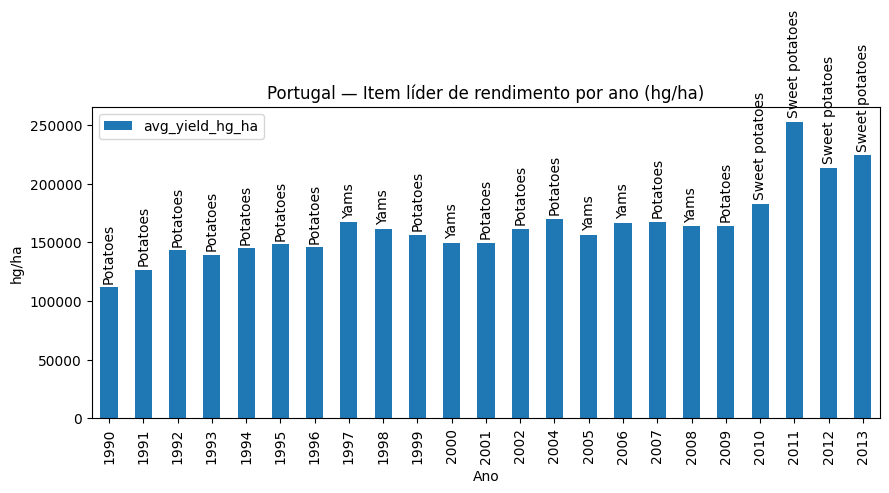
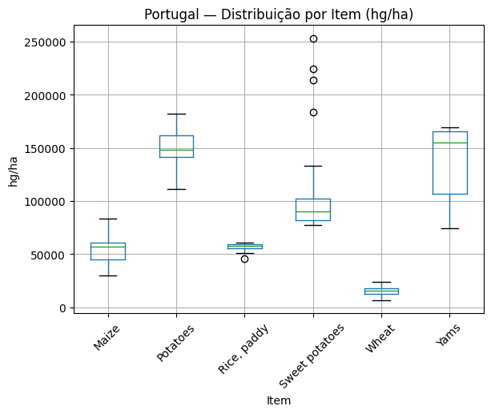
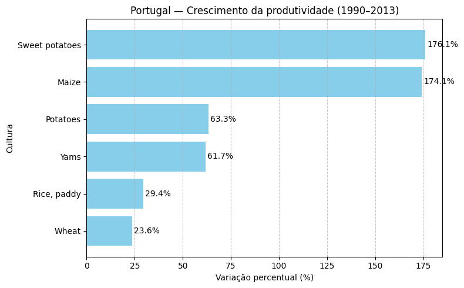
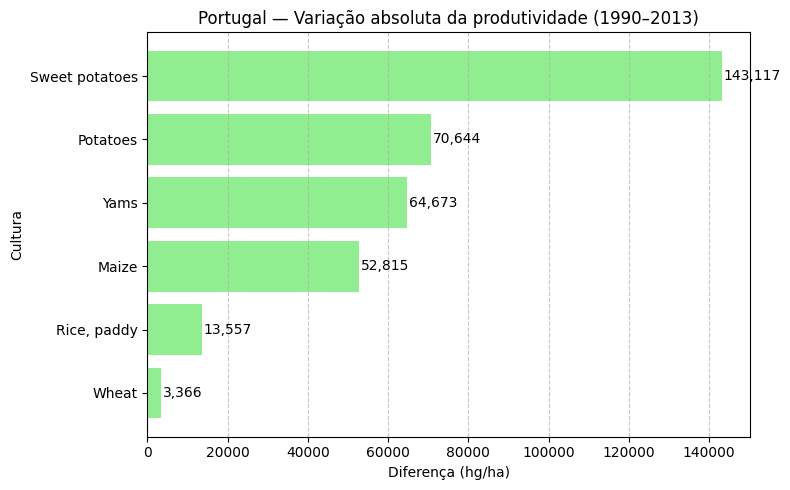

# 🌱 EDA - Produtividade Agrícola em Portugal (1990–2013)

Análise exploratória de dados (EDA) sobre 23 anos de produtividade agrícola em Portugal, com foco em culturas como batata, milho, trigo, arroz, inhame e batata-doce.

Este repositório contém uma **análise exploratória de dados (EDA)** realizada com **PySpark e Python**, utilizando dados públicos de produtividade agrícola disponíveis no [Kaggle](https://www.kaggle.com/datasets/patelris/crop-yield-prediction-dataset/data).  
O objetivo é **identificar padrões, tendências e rupturas** na agricultura portuguesa entre 1990 e 2013, com foco em culturas como **batata, milho, trigo, arroz, inhame e batata-doce**.

---

## 📊 Objetivos da análise
- Explorar estatísticas descritivas da produtividade agrícola.  
- Analisar a evolução temporal por cultura.  
- Identificar padrões de dispersão e outliers (boxplots).  
- Comparar o crescimento percentual e absoluto (1990 → 2013).  
- Traduzir resultados técnicos em **insights estratégicos** para agricultura.

---

## 🔎 Principais resultados
- **Batata-doce** → crescimento estrutural a partir de 2010, liderando em crescimento percentual (+176%) e absoluto (+143.117 hg/ha).  
- **Batata e Inhame** → culturas estáveis e de alta relevância, com ganhos expressivos (+70.644 e +64.673 hg/ha).  
- **Milho** → alta eficiência relativa (+174%), mas impacto absoluto menor que a batata.  
- **Trigo e Arroz** → evolução modesta (<30%), culturas menos competitivas em Portugal.  

---
## 🖼️ Visualizações principais

### 1. Evolução temporal por cultura


### 2. Item líder de rendimento por ano


### 3. Distribuição da produtividade


### 4. Crescimento percentual e absoluto
  
  

> *Obs.: as figuras podem ser atualizadas na pasta `/figures/`.*

---

# 📂 Estrutura do repositório

## Agricultura_Portugal/

#### ├── EDA_agricultura.ipynb # Notebook completo com análise e comentários
#### ├── figures/ # Gráficos gerados pela análise
#### ├── data/ # Datasets utilizados
#### └── README.md # Descrição do projeto

## ⚙️ Como executar
1. Clone este repositório:
   ```bash
   git clone https://github.com/JaquelineFGomesJardim/Agricultura_Portugal.git
   cd Agricultura_Portugal
   Abra o notebook EDA_agricultura.ipynb no Jupyter/Colab.

2. Abra o notebook EDA_agricultura.ipynb no Jupyter/Colab.
3. Execute célula por célula.

# 📌 Próximos passos

### Criar modelos preditivos para previsão de produtividade.
